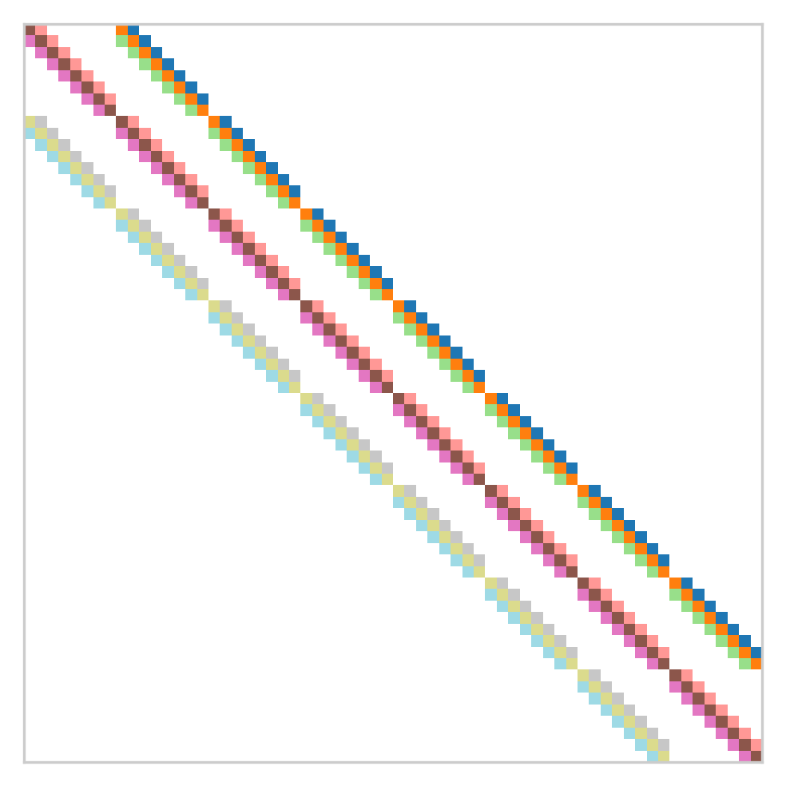
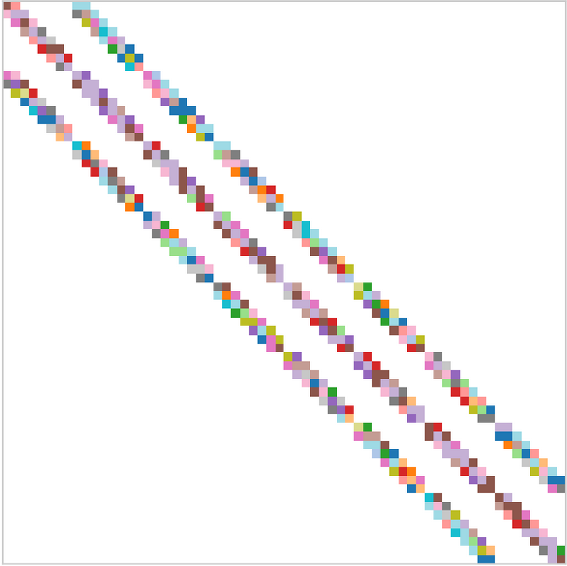
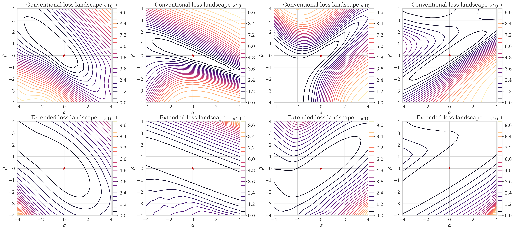
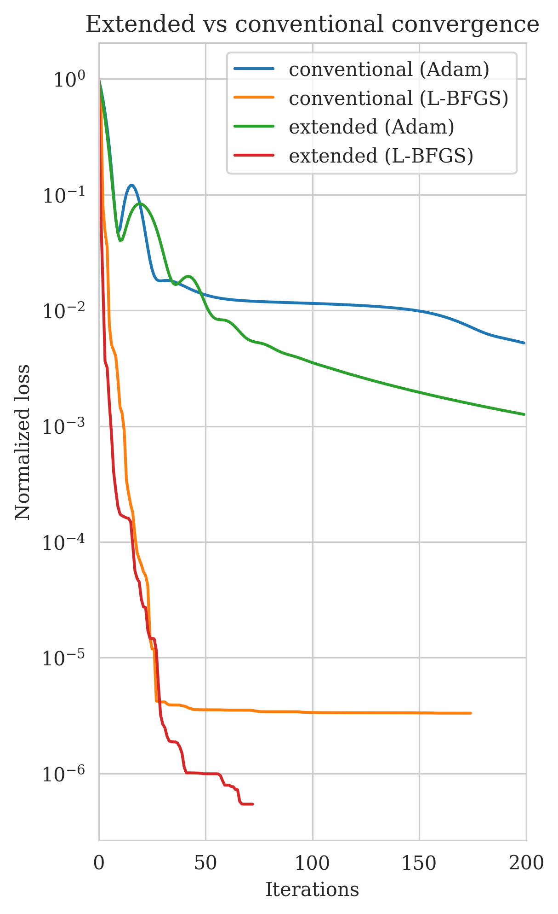
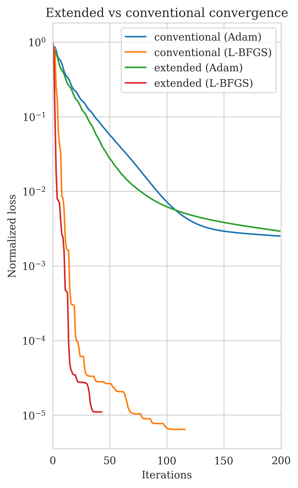
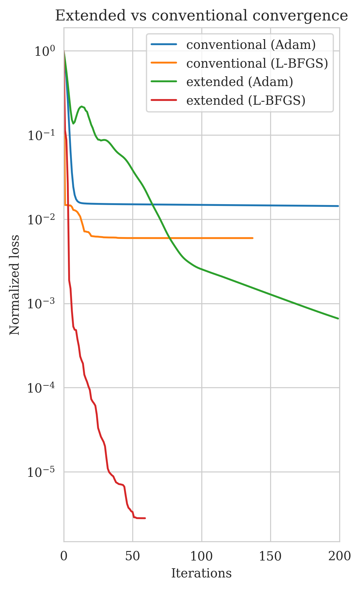

## Summary

We consider extending convolutional layers in convolutional neural networks (CNNs) to convolutions with auxiliary variables. These auxiliary variables amount to non-stationary convolutional weights. As a result, this type of convolutional layers, referred to as extended convolutions, have two sets of variables: primary and auxiliary. The primary variables are the typical weights and biases of conventional convolutional layers in commonly used in CNNs. The auxiliary variables provide an independent convolutional weight for each pixel in the image or in the intermediate feature spaces. The forward propagation of the network involves computing non-stationary convolutions via the auxiliary weights. To train the extended convolutional layers we propose a variable projection scheme where we first solve for auxiliary variables by minimizing a loss function consisting of a conventional loss functions and a penalty term enforcing the non-stationary weights to be close to the primary variable. Next, we take a gradient step for the primary variable by minimizing the penalty term with respect to the primary variable. Through numerical examples applied to a toy neural network with four extended convolutional layers we observe that this extension broadens the valley of global minimizer. This could potentially enhance the ability of networks to generalize and provide opportunity for faster training of network with second order optimization methods. Code to reproduce our results are made available on [GitHub]().

## Method

Here we first describe conventional convolutional layers in a mathematical framework. Next, we introduce our extended convolutional layers. Finally we introduce our variable-projection based approach for training extended convolutional layers.

### Conventional convolutional layers

Consider a conventional convolutional layer denoted by ``\by = \conv(\bx; \bw)`` where ``\bx \in \mathbb{R}^{n}`` is the input, ``\bw \in \mathbb{R}^{n_w}`` the convolutional weights of size ``n_w``, and ``\by \in \mathbb{R}^{m}`` is the convolution output. For simplicity, we are ignoring the bias term and we only concentrate on the convolutional weights. Since this convolution operator is linear, it can be equivalently represented by a matrix-vector product:

```math #mat-vec-reg
\conv(\bx; \bw) = \bbw \bx.
```

In the above expression, matrix ``\bbw \in \mathbb{R}^{m \times n}`` represents the convolution operator. This matrix can be explicitly written as follows:

```math #conv-mat
\bbw = \sum_{i=1}^{n_w} w_{i} \mathbb{I} \mathbf{T}_{t(i)}
```

where ``w_i``'s are elements of ``\bw`` and ``\mathbf{T}_{t(i)}`` is a matrix that is zero everywhere except for the entires on the ``t(i)^{\text{th}}`` diagonal. Figure #weight provides an schematic to the weights ``\bw`` where each color represent a different element ``w_i``, and Figure #mat_W illustrates the matrix ``\bbw`` with colors correspond to different element ``w_i`` of ``\bbw``\. Each color in matrix ``\bbw`` corresponds to an individual term of the summation in Equation #conv-mat\.


### Figure: {#Tk}
{width=20% #weight} \
{width=70% #mat_W}
:Construction of a conventional convolutional matrix ``\bbw`` for a ``3 \times 3`` convolutional layer with one input and output channel, stride one, and no padding. (a) Convolution weight ``\bw``. (b) Convolutional matrix ``\bbw`` (cf. Equation #conv-mat\).


### Extended convolutional layers

Extended convolution operators are different from conventional convolutional layers in that they have an extra set of variables referred to as auxiliary variables. These auxiliary variables correspond to having a different convolutional weight. Given the definitions in the previous section, there are ``n \times n_w`` unknown in the auxiliary variables. We denote these unknowns by ``\left\{ \underline{\bw}_i \right\}_{i=1}^n``, where ``\underline{\bw}_i \in \mathbb{R}^{n_w}``\. Similar to conventional convolution, the extended convolution, denoted by ``\underline{\conv}``, can also be shown as a matrix-vector product:

```math #mat-vec-reg
\underline{\conv}(\bx; \left\{ \underline{\bw}_i \right\}_{i=1}^n) = \underline{\bbw} \bx.
```


Matrix ``\underline{\bbw} \in \mathbb{R}^{m \times n}`` can be written as:

```math #ext-conv-mat
\underline{\bbw}= \sum_{i=1}^{n_w} \diag(\underline{\bw}_i) \mathbf{T}_{t(i)}.
```

Figure #W-ext provides a schematic for ``\underline{\bbw}``\. Comparing Figures #mat_W and #W-ext summarizes the difference between the two convolutional layers.


### Figure: {#W-ext}
{width=50%}
:Extended convolutional matrix.


### Training extended convolutional layers

The overall training loss function for extended convolutional layers is brought below:

```math {#optim-ext}
\mathop{\rm min}_{\left\{w_{i}, \underline{\bw}_{i}\right\}_{i=1}^{n_{w}}} \ \mathcal{L} (\underline{\bbw}) +\frac{\lambda^{2}}{2}\left\| \bbw -\widehat{\bbw} \right\|_F^2.
```

In the equation above, ``\mathcal{L}`` denotes any typical loss function---e.g., ``\ell_2`` norm for regression, crops-entropy for classification, or any divergence between two probability distributions for training generative models. The penalty term ensure all the non-stationary convolutional weights---i.e., rows in Figure #W-ext\, are close to the primary convolutional weight, ``\bw = \left\{w_{i}\right\}_{i=1}^{n_{w}}``


We use variable projection [@aravkin2013ICASSPssi; @vanLeeuwen2014GEOPcav] to train the extended convolutional layers. That is to say we first minimize the loss function in Equation #optim-ext with respect to ``\left\{ \underline{\bw}_{i}\right\}_{i=1}^{n_{w}}``:


```math {#ext-obj}
\left\{\underline{\widehat{\bw}}_{i}\right\}_{i=1}^{n_{w}} := \mathop{\rm \arg,\min} _{\left\{\underline{\bw}_{i}\right\}_{i=1}^{n_{w}}} \mathcal{L} (\underline{\bbw}) +\frac{\lambda^{2}}{2}\left\| \bbw -\widehat{\bbw} \right\|_F^2.
```

Next, we take a gradient step for ``\left\{ w_{i}\right\}_{i=1}^{n_{w}}`` via the following loss function:


```math {#reduced-obj}
\mathop{\rm min}_{\left\{w_{i}\right\}_{i=1}^{n_{w}}} \left\| \bbw -\widehat{\bbw} \right\|_F^2,
```

where ``\widehat{\bbw}`` is the extended convolutional matrix (cf. Equation #ext-conv-mat\) constructed via to ``\left\{\underline{\widehat{\bw}}_{i}\right\}_{i=1}^{n_{w}}`` obtained in Equation #ext-obj\.


## Numerical example

We showcase the effect of the additional auxiliary variables in the extended convolutional layers on the loss landscape via a toy example.

We construct a four-layer CNN with conventional and extended convolutional layers. All the layers have kernel size ``3 \times 3``\, one input and output channel, each with stride one and no padding. We use the sigmoid function after each (extended) convolutional layer. We denote the network with conventional convolutional layers as ``G( \,\cdot\,; \bw)`` and the network with extended convolutional layers as ``\Gext\left( \,\cdot\,;  \bw, \left\{ \underline{\bw}_i \right\}_{i=1}^n \right)``\. Note that here for notational simplicity ``\bw`` and ``\left\{ \underline{\bw}_i \right\}_{i=1}^n `` denote all the primary and auxiliary weights for the four layers combined, respectively. We simulate a training pair by first creating a random fixed input ``\bx \sim \mathrm{N} (\mathbf{0}, \mathbf{I})``. Next, we pass it thorough the conventional network, initialized by an artificial global minimum ``\bw^{\ast}`` to obtain a artificial output pair:

```math {#input-output}
\by = G(\bz; \bw^{\ast}).
```

We visualize the loss landscape around ``\bw^{\ast}`` via the approach described in @visualloss\. In this approach, we randomly draw two random vectors, ``\boldsymbol{\delta}`` and ``\boldsymbol{\eta}``, with the same size as ``\bw^{\ast}`` where the filters in each layer are normalized to have the same mean and standard deviation as the corresponding filter in ``\bw^{\ast}``\. For more details we refer interested readers to @visualloss\.

To visualize the loss landscape for the the network with conventional convolutional layers, we compute the following loss function and we make a 2D visualization of the obtained values as a function of ``\alpha`` and ``\beta``,

```math {#vis-conv}
\mathcal{L} (\bw)  = \frac{1}{2} \Big\| \by - G( \bx,; \bw) \Big\|_2^2\, \quad \bw = \bw^{\ast} + \alpha \boldsymbol{\delta} + \beta \boldsymbol{\eta}.
```

Throughout all examples we choose ``\alpha \in [-4, 4]`` and ``\beta \in [-4, 4]``. We illustrate the above loss landscape in the top row of Figure #landscape\. Each Figure on the top row is indicating the same landscape, but visualized with different random vectors ``\boldsymbol{\delta}`` and  ``\boldsymbol{\eta}``. The dark red star indicates the location of ``\bw^{\ast}``.

Visualizing the loss landscape of the network with extended convolutional layers amounts to solving the optimization problem #ext-obj for all primary variables ``\bw = \bw^{\ast} + \alpha \boldsymbol{\delta} + \beta \boldsymbol{\eta}`` and visualizing the value of that objective at the minimizer. This quantity has formulated below:

```math {#vis-ext-obj}
\mathcal{L}^{\text{ext}} (\bw) = \mathop{\rm \min} _{\left\{\underline{\bw}_{i}\right\}_{i=1}^{n_{w}}}\,
\Big\| \by - \Gext \left( \bx;  \bw, \left\{ \underline{\bw}_i \right\}_{i=1}^n \right) \Big\|_2^2
+\frac{\lambda^{2}}{2}\left\| \bbw -\widehat{\bbw} \right\|_F^2, \quad \bw = \bw^{\ast} + \alpha \boldsymbol{\delta} + \beta \boldsymbol{\eta}.
```

The second row of Figure #landscape indicates these loss landscapes. Each column in Figure #landscape compares the loss landscape for networks with conventional (top) and extended (bottom) convolutional layers. We consistently observe that utilizing extended convolutional layers is widening the global minima valley. This is of great importance in the context of deep networks and their ability to generalize [@chaudhari2019entropy; @foret2020sharpness].

### Figure: {#landscape}
{width=100%}
:Normalized loss landscape. Dark red star indicates the location of ``\bw^{\ast}``. Top rows show the values obtain via Equation #vis-conv for different random vectors ``\boldsymbol{\delta}`` and  ``\boldsymbol{\eta}``\. Bottom rows are visualizing the network with extended convolutions with the same set of random vectors as the top row.


We also demonstrate the enhanced ability of extended convolutions to fit the data and bring down the loss function by plotting normalized loss functions and optimization trajectories of the networks with conventional and extended convolutions layers when initialized with different weights. To achieve this, we solve objectives #vis-conv and #vis-ext-obj for three initial primary weights corresponding to ``(\alpha, \beta) = (-2, 2), \ (2, 2), \ (2, -2)``. We always initial auxiliary weights randomly draw from standard normal distribution---i.e., ``\left\{\underline{\bw}_{i}\right\}_{i=1}^{n_{w}} \sim \mathrm{N} (\mathbf{0}, \mathbf{I})``\. In each figure, we solve the optimization problems #vis-conv and #vis-ext-obj with Adam [@kingma2015adam] and L-BFGS [@liu1989limited] optimization algorithms for ``200`` iterations.

Figures #init0 -- #init2 show the loss function during optimization of the conventional and extended networks for starting primary weights corresponding to ``(\alpha, \beta) = (-2, 2), \ (2, 2), \ (2, -2)``, respectively.

We make the following observations. The extended objective (cf. Equation #vis-ext-obj\) solved with L-BFGS algorithm brings down the residual more the all the other alternatives for most of the initial primary weights and iterations. When solved with Adam, the extended objective often brings down the loss more than the conventional objective (Equation #vis-conv\).


### Figure: {#loss-comp}
{width=33.3% #init0}
{width=33.3% #init1}
{width=33.3% #init2}
:Optimization loss comparison.


```math_def
\usepackage{mathtools}
\newcommand{\bx}{\mathbf{x}}
\newcommand{\bz}{\mathbf{z}}
\newcommand{\bbx}{\mathbf{X}}
\newcommand{\by}{\mathbf{y}}
\newcommand{\bby}{\mathbf{Y}}
\newcommand{\bw}{\mathbf{w}}
\newcommand{\diag}{\operatorname{diag}}
\newcommand{\bbw}{\mathbf{W}}
\newcommand{\conv}{\text{conv}}
\newcommand{\Gext}{G^{\text{ext}}}
```
